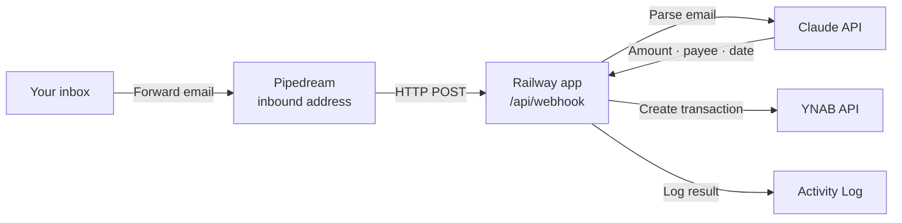

# YNAB Automation

YNAB automatically categorizes transactions by payee — which works great until you
shop at a place like Amazon, where one order might be groceries, another electronics,
and another home supplies. YNAB sees the same payee every time and can't tell them
apart. You end up manually opening each order confirmation email to figure out what
you actually bought before you can categorize the transaction.

This app eliminates that lookup. Forward your order confirmation emails to a
dedicated address — the app extracts the details and creates a YNAB transaction
automatically, within seconds.

> **No warranty.** This is a personal side project, provided as-is, with no warranty
> and no support. If the app misposts a transaction to your YNAB budget, corrupts a
> setting, loses data, or does anything else unexpected, you are responsible for fixing
> it. Running it against real money is your call. The MIT license at the bottom of this
> repo spells out the formal terms. Nothing on this page is financial advice.

> **AI-generated.** Every line of code, every test, every line of this README —
> everything in this repository was written by Claude (Anthropic's language model) under
> human direction. No human wrote any code by hand. This is a deliberate experiment in
> AI-assisted software delivery. You should evaluate whether that matches your risk
> tolerance before running it against real money.

## Features

### Dashboard

At-a-glance view of your automation stats — emails processed this week, success
rate, and the most recent transactions created. See exactly what happened and
when, without opening YNAB.

### Settings

Configure your YNAB connection, API keys, sender routing rules, and currency
routing — all from a single page. No code edits, no Railway env-var juggling.
Flip test mode on to dry-run the pipeline without creating real YNAB
transactions.

### Activity Log

Every forwarded email gets a row: green for a created YNAB transaction, red for
parse or API errors, blue for test mode. Expand any row to see Claude's full
parse reasoning. Replay any email with one click.

---

> **True one-click.** The button opens a Railway template that provisions
> PostgreSQL, wires `DATABASE_URL`, and deploys the app. No environment variables
> to fill in — click **Deploy Now** and it works. The session secret is
> auto-generated and stored in the database on first boot. Every other value —
> API keys, YNAB token, Pipedream address, admin password — is collected by the
> setup wizard after the app is running.

---

## What This Is

When you receive an order confirmation from any online retailer — Amazon, eBay, Costco,
Apple, or anywhere else — you forward that email to a Pipedream inbound address. The app
reads the email, asks Claude to extract the amount, retailer name, currency, and order
date, and creates a YNAB transaction in your chosen account. The whole process takes a
few seconds.

The app runs on your own Railway account. It connects to your YNAB budget through a
personal access token (a kind of password for the YNAB API), and to Claude through an
Anthropic API key. You own the data; nothing is shared with a third party beyond the
API calls themselves.

This is self-hosted, open-source software. There is no managed version and no
subscription. You deploy it once and it keeps running.

---

## How It Works

1. You set an auto-forward rule in your email client (or forward manually) to send
   order confirmation emails to your Pipedream inbound address.
2. Pipedream fires an HTTP request to your Railway app.
3. The app sends the email body to Claude, which extracts the amount, payee (retailer),
   currency, and order date.
4. The app calls the YNAB API and creates a transaction in your chosen account.
5. The result — success or error — is recorded in the Activity Log on your dashboard.

---

## Install

### Step 1 — Deploy to Railway

Click the **Deploy on Railway** button above. If you don't have a Railway account, sign up first (GitHub login is fastest). You'll land on the YNAB Automation template preview showing the app and a PostgreSQL database. Click **Deploy Now** — no environment variables to fill in.

Wait for the service to show a green check (2–4 minutes the first time).

### Step 2 — Find your app URL

Once the deploy is green, click the app service name in your Railway project. The public URL is shown at the top of the service page (it looks like `https://something.up.railway.app`). You can also find it under **Settings → Networking**. Copy the URL.

### Step 3 — Open the app and set up

Open the URL in a browser. The app starts on a "set your password" screen — this is the setup wizard. The wizard walks you through connecting your YNAB budget, Anthropic API key, Resend API key, and Pipedream inbound address one step at a time, with direct links to each service at the step where you need it.

**If you get stuck**, the [Troubleshooting](#troubleshooting) section covers the most common first-deploy issues.

### After Setup — Set Up Email Forwarding

Now tell your email client to automatically forward order confirmation emails to the
Pipedream inbound address you entered in Step 8.

**In Gmail:**

1. Open **Settings** (the gear icon, top right) and click **See all settings**.
2. Go to the **Filters and Blocked Addresses** tab and click **Create a new filter**.
3. In the "From" field, enter the sender address you want to forward — for example,
   `ship-confirm@amazon.com` for Amazon shipment confirmations.
4. Click **Create filter**, tick **Forward it to**, and select (or add) the Pipedream
   inbound email address.
5. Click **Create filter** to save.

You can repeat this process for each retailer you want to track. Common sender
addresses to forward:

| Retailer | Common sender address |
|----------|-----------------------|
| Amazon | `ship-confirm@amazon.com` or `order-update@amazon.com` |
| eBay | `auto-confirm@ebay.com` |
| Costco | `no-reply@costco.com` |
| Apple | `no_reply@email.apple.com` |

If you are unsure of the exact sender address for a retailer, forward one email
manually first and check the Activity Log — the sender address is recorded there.

**In Apple Mail:**

Go to **Mail → Settings → Rules**, click **Add Rule**, set the condition to
"From contains [sender address]", and set the action to "Forward Message" with the
Pipedream address.

**In Outlook:**

Go to **Settings → Mail → Rules**, click **Add a new rule**, match on the sender
address, and set the action to "Forward to" the Pipedream address.

Each forwarded email is processed independently. Forwarding the same email twice
is safe — the app deduplicates by message ID, so the transaction will only be
created once.

### After Setup — Send a Test Email

Forward any real order confirmation email to the Pipedream address manually. Within
60 seconds, open the Activity Log in your dashboard. You should see one new entry:

- **Status: success** — a transaction was created in YNAB. Check YNAB to confirm.
- **Status: error** — the app tried but something went wrong. Click the row to see
  the error detail. See [Troubleshooting](#troubleshooting) for next steps.

If nothing appears in the Activity Log after 60 seconds, Pipedream may not be
forwarding the request. Check the Pipedream workflow logs first.

---

## Costs

All costs are pay-as-you-go or metered on free tiers. At household forwarding volume
(a few emails per week), total spending is well under a few dollars per month.

| Service | What you pay | Pricing page |
|---------|-------------|--------------|
| Railway | Hobby tier: flat monthly fee for always-on hosting and the included PostgreSQL database | [railway.app/pricing](https://railway.app/pricing) |
| Anthropic | Pay per API call. Each email parse costs a fraction of a cent — at household volume, expect well under the price of a cup of coffee per month | [anthropic.com/pricing](https://anthropic.com/pricing) |
| Resend | Free tier covers 3,000 emails per month. This app only sends emails on errors, so you will rarely approach the limit | [resend.com/pricing](https://resend.com/pricing) |
| YNAB | Requires an active YNAB subscription, which you already have if you are using YNAB | [ynab.com/pricing](https://www.youneedabudget.com/pricing) |
| Pipedream | Free tier is sufficient for household forwarding volume | [pipedream.com/pricing](https://pipedream.com/pricing) |

---

## Troubleshooting

### Nothing appears in the Activity Log after forwarding an email

Check Pipedream first. Open your Pipedream workflow and look at the execution history
— did the workflow run when you forwarded the email? If not, the email may not have
matched your forwarding rule, or the rule has not taken effect yet (Gmail can take a
few minutes).

If the Pipedream workflow ran but the Activity Log is still empty, confirm the HTTP
action in Pipedream is pointing at the correct Railway URL:
`https://your-app-name.up.railway.app/api/webhook`

### Activity Log shows "YNAB error"

The app reached YNAB but the API rejected the transaction. Common causes:

- **Expired or invalid YNAB personal access token** — Go to Settings, re-enter the
  token, and save. Then open [YNAB Developer Settings](https://app.ynab.com/settings/developer)
  to confirm the token has not been revoked.
- **Wrong budget or account ID** — Go to Settings and confirm the budget and account
  selections. If the dropdowns are empty, your YNAB token may have expired.

### Activity Log shows "parse error" or Claude-related error

The app reached Anthropic but something went wrong. Common causes:

- **Invalid Anthropic API key** — Go to Settings and re-enter the key. Then confirm
  the key is still active in the [Anthropic Console](https://console.anthropic.com/settings/keys).
- **Anthropic account has no credits** — The Anthropic API requires a payment method
  and a positive credit balance. Add credits at [console.anthropic.com](https://console.anthropic.com).

### Error notification emails are not arriving

If you expect an error email but never receive one:

- Confirm the Resend API key in Settings is correct.
- In your Resend dashboard, check that your sending domain is verified. Resend
  requires domain verification before it will deliver email.
- Check your spam folder.

### The budget dropdown at Step 3 shows "could not load budgets"

The YNAB personal access token entered in Step 2 is invalid or does not have access
to any budgets. Go back to Step 2 and re-enter the token. Generate a new one from
[YNAB Developer Settings](https://app.ynab.com/settings/developer) if needed.

### The app returns a 404 or 500 on every page

The Railway deployment may have failed. Open your Railway dashboard, select the
service, and check the build and deploy logs. If the build failed, look for a
TypeScript or dependency error in the logs.

If the deploy succeeded but the app is returning 500, check that the DATABASE_URL
environment variable is set (Railway should set this automatically when PostgreSQL
is provisioned).

### The setup wizard keeps restarting from the beginning

The wizard resumes from the last completed step on each visit. If it is starting
over, the `WIZARD_COMPLETE` setting may have been accidentally deleted from the
database. Open Settings and confirm your configuration is intact. If all settings
are missing, re-run the wizard from the beginning.

### The dashboard redirects to the login page even after logging in

Your session may have expired. Log in again. If the redirect loop persists,
your session secret may have been regenerated (for example, if the database was
reset). Logging in again will set a fresh session cookie.

### I forgot my admin password and cannot log in

Set the `RESET_PASSWORD` environment variable to `true` in your Railway service's
Variables tab, then redeploy (or trigger a restart). On the next request the app
will clear your admin password and reset the setup wizard so you can choose a new
password. Remove `RESET_PASSWORD` (or set it to `false`) immediately after you
have set your new password, then redeploy again.

### Email arrives in Pipedream but no transaction appears and no Activity Log entry

If the Pipedream workflow shows a successful run but nothing appears in the Activity
Log, the HTTP action in Pipedream may be posting to the wrong URL or using the wrong
HTTP method.

Confirm:
- The URL is exactly `https://your-app-name.up.railway.app/api/webhook` (no trailing
  slash, `https`, your actual subdomain).
- The method is **POST**, not GET.
- The body is set to pass through the original request body from the Email trigger.

In Pipedream, you can click the HTTP step in a completed run to see what was sent and
what the response code was. A `200` response means the app received and processed it.
A `401` or `500` indicates a configuration problem on the app side — check Railway logs.

### An email was processed but the transaction amount is wrong

Claude extracts the amount from the email text. If the email contains multiple amounts
(e.g. subtotal, shipping, tax, and total on separate lines), Claude may occasionally
pick the wrong one.

If this happens:
1. Open the Activity Log and click the row for that email.
2. The parse result shows what Claude extracted. Review the fields.
3. If Claude consistently misreads emails from a particular retailer, open an issue
   with a sample email (remove personal details) so the prompt can be adjusted.

The transaction created in YNAB is not automatically corrected — you will need to
edit it manually in YNAB.

---

## Self-Hosting Note

This is self-hosted, open-source software. You deploy it to your own Railway account,
and all data — your YNAB token, Anthropic key, and activity log — stays in your own
PostgreSQL database. There is no managed hosted version and no telemetry sent back to
anyone.

Railway is the recommended host because the deploy button handles PostgreSQL
provisioning automatically, but any platform that runs a Node.js app with a PostgreSQL
database will work. The only required environment variable for a cold-start deploy is
`DATABASE_URL` (set automatically by Railway when a PostgreSQL plugin is linked);
all other configuration — including the session secret — is auto-generated or entered
through the wizard and stored in the database.

---

## Contributing

Issues and pull requests welcome. This project follows the [GSD workflow](https://github.com/punkpeye/get-shit-done) — changes are planned in `.planning/` and implemented phase by phase.

## License

MIT. See [LICENSE](LICENSE).

---

*Built entirely with [Claude Code](https://claude.ai/claude-code).*
