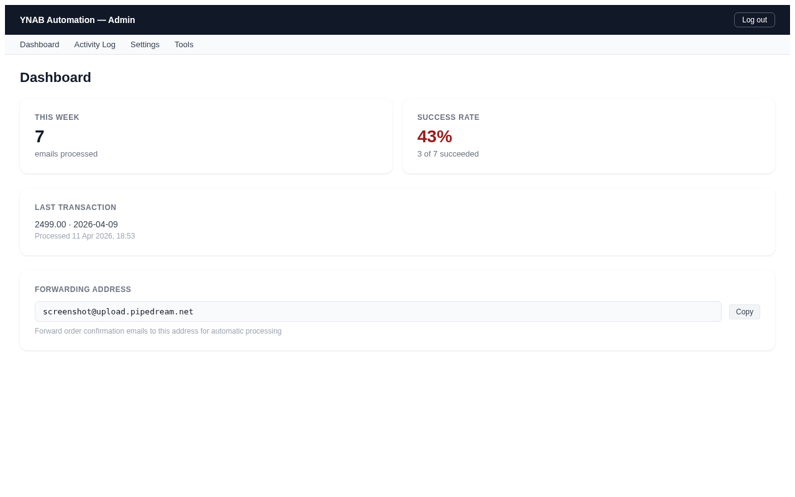
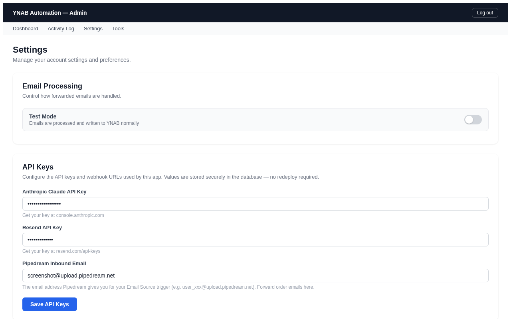
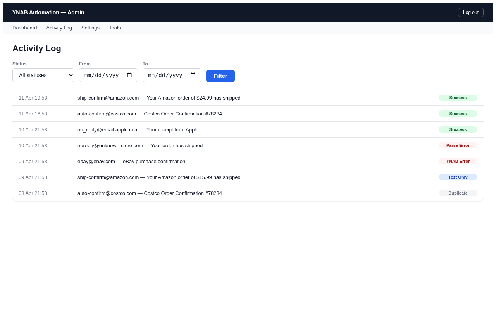
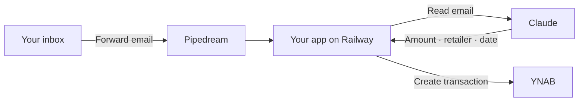

# YNAB Automation

YNAB automatically categorizes transactions by payee — which works great until you
shop at a place like Amazon, where one order might be groceries, another electronics,
and another home supplies. YNAB sees the same payee every time and can't tell them
apart. You end up manually opening each order confirmation email to figure out what
you actually bought before you can categorize the transaction.

This app eliminates that lookup. Forward your order confirmation emails to a
dedicated address — the app reads the receipt, extracts the details, and creates
a YNAB transaction automatically within seconds.

---

[What It Costs](#what-it-costs) · [Set Up](#set-up) · [What You Get](#what-you-get) · [How It Works](#how-it-works) · [Troubleshooting](#troubleshooting)

---

## What It Costs

About **$5–6 per month** at typical household volume (a few emails per week).

| Service | Cost | Why you need it |
|---------|------|-----------------|
| [Railway](https://railway.com/pricing) | $5/month (Hobby plan) | Runs the app and database |
| [Anthropic](https://anthropic.com/pricing) | Pennies per month | Claude reads your emails |
| [YNAB](https://www.youneedabudget.com/pricing) | Your existing subscription | Where transactions go |
| [Pipedream](https://pipedream.com/pricing) | Free | Receives forwarded emails |
| [Resend](https://resend.com/pricing) | Free | Sends you error alerts |

Railway requires the Hobby plan ($5/month) — the free trial works for 30 days but
the app needs to run continuously after that. Everything else fits within free tiers.

---

## Set Up

The whole process takes about 10 minutes. You don't need to write any code.

### 1. Deploy to Railway

Click the button above — it opens Railway in a new tab. If you don't have a Railway
account, sign up first (GitHub login is fastest). On the template page, click
**Deploy Now** — there's nothing to fill in.

Wait for the green check (2–4 minutes).

### 2. Open your app

Once the deploy finishes, click the app service name in your Railway dashboard.
Your app URL is shown at the top of the page — something like
`https://something.up.railway.app`. You can also find it under
**Settings → Networking**. Open that URL in your browser.

### 3. Run the setup wizard

The app opens on a "set your password" screen. This is the setup wizard — it walks
you through connecting your YNAB budget, Anthropic API key, Resend API key, and
Pipedream address, one step at a time. Each step links directly to the page where
you create the account or get the key.

### 4. Set up email forwarding

After the wizard, tell your email client to forward order confirmations to the
Pipedream address from the wizard.

**Gmail:**
1. Open **Settings** → **See all settings** → **Filters and Blocked Addresses**.
2. Click **Create a new filter**. In "From", enter the sender — for example,
   `ship-confirm@amazon.com`.
3. Click **Create filter**, tick **Forward it to**, select the Pipedream address.

**Apple Mail:**
Go to **Mail → Settings → Rules**, add a rule matching the sender address, and
forward to the Pipedream address.

**Outlook:**
Go to **Settings → Mail → Rules**, add a rule matching the sender, forward to
the Pipedream address.

Repeat for each retailer. Common senders:

| Retailer | Sender address |
|----------|---------------|
| Amazon | `ship-confirm@amazon.com` |
| eBay | `auto-confirm@ebay.com` |
| Apple | `no_reply@email.apple.com` |

### 5. Test it

Forward any real order confirmation email to the Pipedream address. Within a minute,
check the Activity Log in your dashboard. You should see a green row — and a
matching transaction in YNAB.

---

## What You Get

### Dashboard

See what's happening at a glance — emails processed, success rate, and recent
transactions. No need to open YNAB to check if things are working.

### Settings

Change any setting from the browser — YNAB connection, API keys, sender routing
rules, currency routing. Flip test mode on to try things without creating real
transactions.

### Activity Log

Every forwarded email gets a row. Green means a transaction was created, red means
something went wrong. Click any row to see exactly what happened. Replay any email
with one click.

---

## How It Works

1. You set up an auto-forward rule in Gmail (or Outlook, Apple Mail) to send order
   confirmation emails to a Pipedream address.
2. The app uses Claude to read the email and extract the amount, retailer, and date.
3. A transaction appears in your YNAB budget within seconds.

The app runs on your own Railway account. Your data stays in your own database —
nothing is shared with anyone beyond the API calls themselves.

---

## Troubleshooting

### Nothing appears in the Activity Log

Open your Pipedream workflow and check the execution history. If the workflow didn't
run, your email forwarding rule may not have taken effect yet (Gmail can take a few
minutes). If it did run, confirm the HTTP step is pointing at your Railway URL:
`https://your-app.up.railway.app/api/webhook`.

### Activity Log shows a YNAB error

Your YNAB personal access token may have expired. Go to Settings in the app,
re-enter the token, and save. You can generate a new one from
[YNAB Developer Settings](https://app.ynab.com/settings/developer).

### Activity Log shows a parse or Claude error

Your Anthropic API key may be invalid or out of credits. Go to Settings, re-enter
the key. Check your balance at [console.anthropic.com](https://console.anthropic.com).

### The transaction amount is wrong

Claude reads the email text and occasionally picks the wrong number when the email
lists subtotal, shipping, tax, and total separately. Check the Activity Log for
what Claude extracted. You'll need to correct the transaction in YNAB manually.

### I forgot my admin password

In your Railway dashboard, go to the app service's **Variables** tab. Add
`RESET_PASSWORD` set to `true`, then redeploy. The app will reset your password
and send you back to the setup wizard. Remove `RESET_PASSWORD` afterward.

---

## About This Project

This is open-source, self-hosted software. There is no managed version, no
subscription, and no telemetry. You deploy it once and it keeps running on your
own Railway account.

Every line of code, every test, and this README were written by
[Claude](https://claude.ai) under human direction. No human wrote any code by hand.

This is a personal side project provided as-is, with no warranty and no support.
If something goes wrong with a transaction, you are responsible for fixing it in
YNAB. See [LICENSE](LICENSE) for the full terms (MIT).

Issues and pull requests welcome.

---

*Built with [Claude Code](https://claude.ai/claude-code).*
