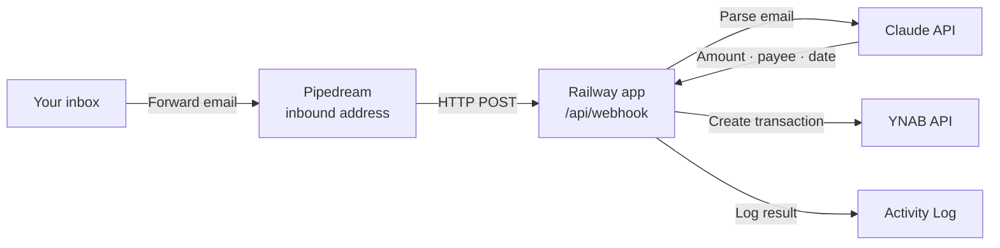
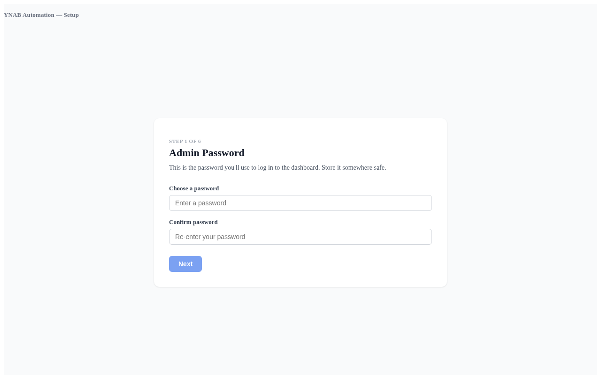
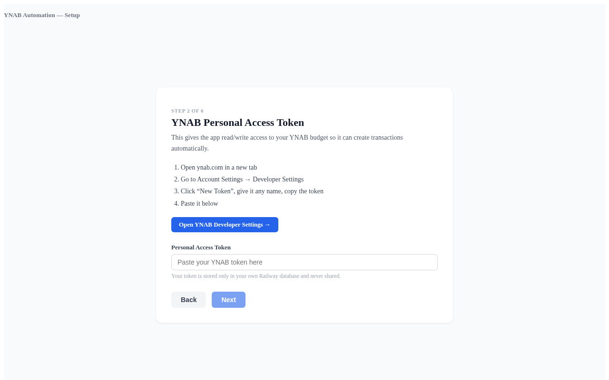
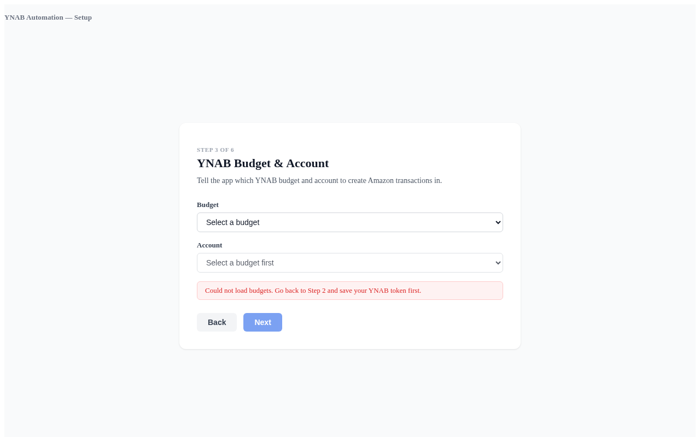
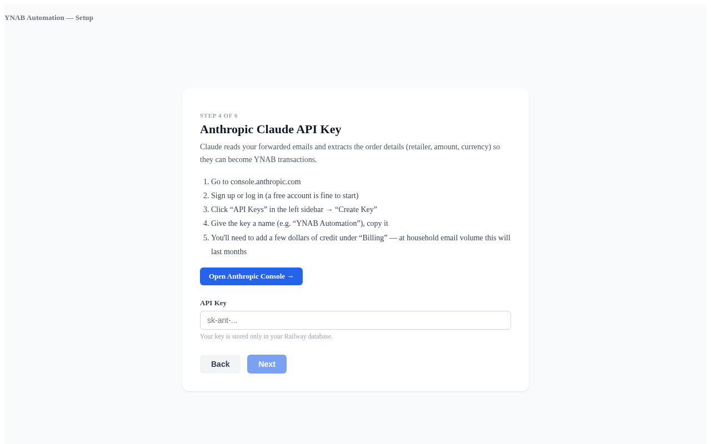
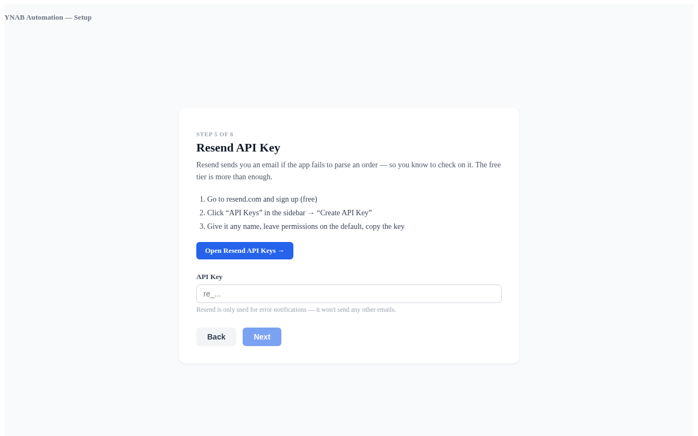
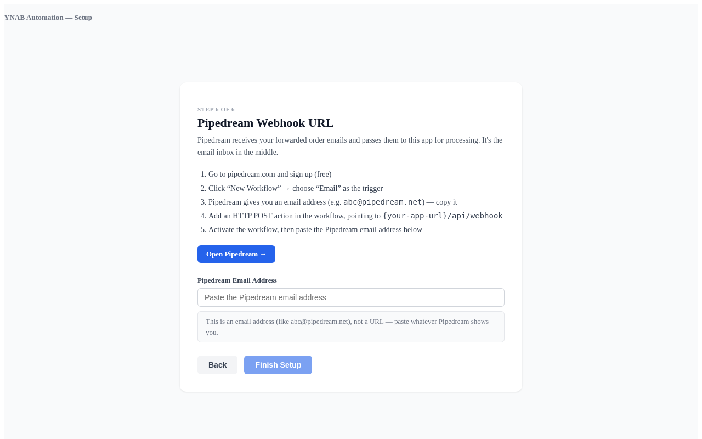
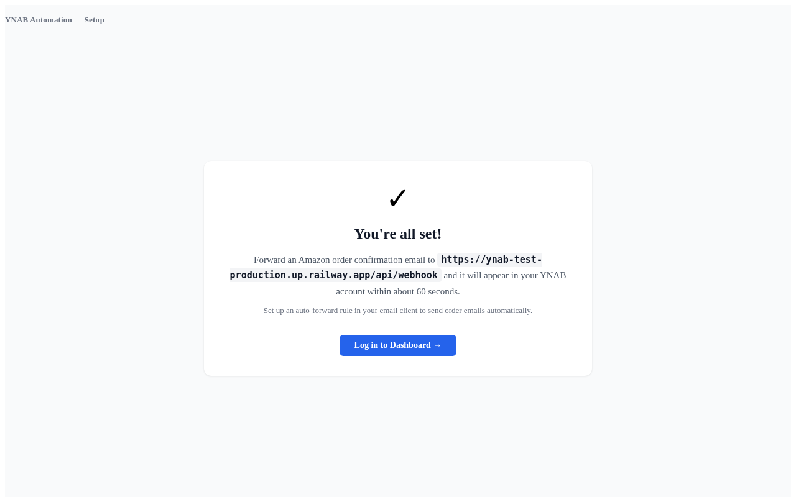

# YNAB Automation

Automatically creates YNAB transactions from forwarded order confirmation emails.
Forward an order confirmation to a dedicated address — a transaction appears in your
budget within seconds, with no manual entry.

> **No warranty.** This is a personal side project, provided as-is, with no warranty
> and no support. If the app misposts a transaction to your YNAB budget, corrupts a
> setting, loses data, or does anything else unexpected, you are responsible for fixing
> it. Running it against real money is your call. The MIT license at the bottom of this
> repo spells out the formal terms. Nothing on this page is financial advice.

> **AI-generated.** Every line of code, every test, every line of this README —
> everything in this repository was written by Claude (Anthropic's language model) under
> human direction. No human wrote any code by hand. This is a deliberate experiment in
> AI-assisted software delivery. You should evaluate whether that matches your risk
> tolerance before running it against real money.

[](https://railway.com/deploy?template=https%3A%2F%2Fgithub.com%2Fmirkanu%2Fynab-automation)

---

## What This Is

When you receive an order confirmation from any online retailer — Amazon, eBay, Costco,
Apple, or anywhere else — you forward that email to a Pipedream inbound address. The app
reads the email, asks Claude to extract the amount, retailer name, currency, and order
date, and creates a YNAB transaction in your chosen account. The whole process takes a
few seconds.

The app runs on your own Railway account. It connects to your YNAB budget through a
personal access token (a kind of password for the YNAB API), and to Claude through an
Anthropic API key. You own the data; nothing is shared with a third party beyond the
API calls themselves.

This is self-hosted, open-source software. There is no managed version and no
subscription. You deploy it once and it keeps running.

---

## How It Works



1. You set an auto-forward rule in your email client (or forward manually) to send
   order confirmation emails to your Pipedream inbound address.
2. Pipedream fires an HTTP request to your Railway app.
3. The app sends the email body to Claude, which extracts the amount, payee (retailer),
   currency, and order date.
4. The app calls the YNAB API and creates a transaction in your chosen account.
5. The result — success or error — is recorded in the Activity Log on your dashboard.

---

## Prerequisites

You need accounts with the following services before starting. You can create the
accounts as you go through the wizard — the wizard links to each service's relevant
page at the step where you need it.

| Service | What it does in this app | When you need it |
|---------|--------------------------|-----------------|
| [Railway](https://railway.app/) | Hosts the app and the PostgreSQL database | Step 1 (deploy) |
| [YNAB](https://www.ynab.com/) | The budget where transactions are created | Step 4 (token) |
| [Anthropic](https://www.anthropic.com/) | Claude API — parses the email into structured transaction data | Step 6 (API key) |
| [Pipedream](https://pipedream.com/) | Receives forwarded emails and passes them to the app | Step 8 (workflow) |
| [Resend](https://resend.com/) | Sends you an email when something goes wrong | Step 7 (API key) |

With two exceptions, you do not need to set any environment variables manually —
the wizard collects each value and stores it in the database. The two exceptions
are set once during Step 1 (deploy) and never touched again: `DATABASE_URL` (set
automatically when you add the PostgreSQL plugin) and `IRON_SESSION_SECRET` (a
random string you generate once on the Variables page).

See [Costs](#costs) for what each service charges.

---

## Install

Follow these steps in order. Each step links to the place where you get the value
or perform the action described. The wizard in the app guides you through each step
and validates your inputs before moving on.

### Step 1 — Deploy to Railway

1. Click the **Deploy on Railway** button at the top of this page. If you do not
   have a Railway account yet, sign up (the GitHub login option is fastest).
2. On the "New Project" screen, choose **"Deploy from GitHub repo"**, then select
   `mirkanu/ynab-automation` from the list. (If the repo is not listed, click
   "Configure GitHub App" and give Railway access to the repo first, then come
   back.)
3. Railway will start building. While the build is running, click the **`+ New`**
   button in the project view and choose **"Database" → "Add PostgreSQL"**. This
   provisions the database and automatically sets `DATABASE_URL` for the app
   service.
4. Open the app service's **Variables** tab and confirm `DATABASE_URL` is present.
   If `IRON_SESSION_SECRET` is not yet set, click **"New Variable"**, name it
   `IRON_SESSION_SECRET`, and use Railway's **"Generate"** button (or paste any
   random 32-character string). Save.
5. Railway will redeploy with the new variables. Wait for the service to show a
   green check.
6. Click the service to open its page. Under **Settings → Networking**, click
   **"Generate Domain"** to create a public URL for the app. Copy the URL —
   something like `https://your-app.up.railway.app` — and open it in a browser.

**If you get stuck at any step**, the [Troubleshooting](#troubleshooting) section
covers the most common first-deploy issues.

### Step 2 — Open the Setup Wizard

Visiting the app URL for the first time shows the setup wizard. The wizard stores
each value in the database as you go, so you can close the browser and return later
— it will resume where you left off.

### Step 3 — Admin Password (Wizard Step 1)



Choose a password for the admin interface. This is the password you will use to log
in to the dashboard each time. Pick something you will remember; you can change it
later from the Settings page.

### Step 4 — YNAB Personal Access Token (Wizard Step 2)



A personal access token is a long string that gives the app read/write access to your
YNAB budget. You generate one in your YNAB account settings.

1. Open [YNAB Developer Settings](https://app.ynab.com/settings/developer) in a
   new tab.
2. Click **New Token**, give it a name (e.g. "Railway automation"), and click
   **Generate**.
3. Copy the token — YNAB will only show it once.
4. Paste it into the wizard and click Next.

### Step 5 — Budget and Account (Wizard Step 3)



After you enter a valid YNAB token, the wizard loads your budgets and accounts from
the YNAB API. Select the budget you want transactions to appear in, then select the
specific account (e.g. "Visa Checking").

If the dropdowns show an error, your personal access token from step 4 may be
incorrect. Go back and re-enter it.

### Step 6 — Anthropic API Key (Wizard Step 4)



The Anthropic API key allows the app to call Claude to parse your email text. API
keys are account credentials — treat them like a password.

1. Open the [Anthropic Console API Keys page](https://console.anthropic.com/settings/keys)
   in a new tab.
2. Click **Create Key**, give it a name, and copy the key.
3. Paste it into the wizard and click Next.

Note: you will need to add a credit card to your Anthropic account to activate API
access. See [Costs](#costs) for expected usage.

### Step 7 — Resend API Key (Wizard Step 5)



Resend sends you an email when the app encounters an error — for example, if Claude
cannot parse an email or YNAB rejects a transaction. Without this key the app still
works, but errors are silent.

1. Open [Resend API Keys](https://resend.com/api-keys) in a new tab.
2. Click **Create API Key**, name it, and copy it.
3. Paste it into the wizard and click Next.

### Step 8 — Pipedream Inbound Email (Wizard Step 6)



Pipedream is the service that receives your forwarded emails and passes them to the
app. In this step you create a Pipedream workflow and paste the inbound email address
it gives you.

1. Open [Pipedream](https://pipedream.com) and sign in or create a free account.
2. Click **New Project** (or go directly to **Workflows**) and create a new workflow.
3. When asked for a trigger, choose **Email**. Pipedream generates a unique inbound
   email address for this workflow — something like
   `incoming@mhtr.m.pipedream.net`. This is the address you will forward emails to.
4. Add a step to the workflow. Choose **HTTP / Webhook** from the step library (it may
   be listed as "Send HTTP Request").
   - Set the method to **POST**.
   - Set the URL to your Railway app's webhook URL:
     ```
     https://your-app-name.up.railway.app/api/webhook
     ```
     Replace `your-app-name` with the actual subdomain shown in your Railway dashboard.
   - Under the request body, choose "Use entire trigger event body" or "Pass raw body
     as-is" — the exact wording varies by Pipedream version, but the goal is to send
     the full email payload from the trigger to your app.
5. Click **Deploy** to activate the Pipedream workflow.
6. Copy the inbound email address shown on the Email trigger step.
7. Paste that email address into the wizard field and click **Finish Setup**.

The Pipedream inbound address is also stored in Settings after the wizard completes,
in case you need to refer back to it. It is the address you will add to your email
forwarding rules in Step 10.

### Step 9 — Finish Setup



Clicking Finish Setup saves all your settings and marks the wizard as complete. The
app redirects you to the dashboard. From here you can view the Activity Log, adjust
settings at any time, and replay past emails if something went wrong the first time
through.

### Step 10 — Set Up Email Forwarding

Now tell your email client to automatically forward order confirmation emails to the
Pipedream inbound address you entered in Step 8.

**In Gmail:**

1. Open **Settings** (the gear icon, top right) and click **See all settings**.
2. Go to the **Filters and Blocked Addresses** tab and click **Create a new filter**.
3. In the "From" field, enter the sender address you want to forward — for example,
   `ship-confirm@amazon.com` for Amazon shipment confirmations.
4. Click **Create filter**, tick **Forward it to**, and select (or add) the Pipedream
   inbound email address.
5. Click **Create filter** to save.

You can repeat this process for each retailer you want to track. Common sender
addresses to forward:

| Retailer | Common sender address |
|----------|-----------------------|
| Amazon | `ship-confirm@amazon.com` or `order-update@amazon.com` |
| eBay | `auto-confirm@ebay.com` |
| Costco | `no-reply@costco.com` |
| Apple | `no_reply@email.apple.com` |

If you are unsure of the exact sender address for a retailer, forward one email
manually first and check the Activity Log — the sender address is recorded there.

**In Apple Mail:**

Go to **Mail → Settings → Rules**, click **Add Rule**, set the condition to
"From contains [sender address]", and set the action to "Forward Message" with the
Pipedream address.

**In Outlook:**

Go to **Settings → Mail → Rules**, click **Add a new rule**, match on the sender
address, and set the action to "Forward to" the Pipedream address.

Each forwarded email is processed independently. Forwarding the same email twice
is safe — the app deduplicates by message ID, so the transaction will only be
created once.

### Step 11 — Send a Test Email

Forward any real order confirmation email to the Pipedream address manually. Within
60 seconds, open the Activity Log in your dashboard. You should see one new entry:

- **Status: success** — a transaction was created in YNAB. Check YNAB to confirm.
- **Status: error** — the app tried but something went wrong. Click the row to see
  the error detail. See [Troubleshooting](#troubleshooting) for next steps.

If nothing appears in the Activity Log after 60 seconds, Pipedream may not be
forwarding the request. Check the Pipedream workflow logs first.

---

## Costs

All costs are pay-as-you-go or metered on free tiers. At household forwarding volume
(a few emails per week), total spending is well under a few dollars per month.

| Service | What you pay | Pricing page |
|---------|-------------|--------------|
| Railway | Hobby tier: flat monthly fee for always-on hosting and the included PostgreSQL database | [railway.app/pricing](https://railway.app/pricing) |
| Anthropic | Pay per API call. Each email parse costs a fraction of a cent — at household volume, expect well under the price of a cup of coffee per month | [anthropic.com/pricing](https://anthropic.com/pricing) |
| Resend | Free tier covers 3,000 emails per month. This app only sends emails on errors, so you will rarely approach the limit | [resend.com/pricing](https://resend.com/pricing) |
| YNAB | Requires an active YNAB subscription, which you already have if you are using YNAB | [ynab.com/pricing](https://www.youneedabudget.com/pricing) |
| Pipedream | Free tier is sufficient for household forwarding volume | [pipedream.com/pricing](https://pipedream.com/pricing) |

---

## Troubleshooting

### Nothing appears in the Activity Log after forwarding an email

Check Pipedream first. Open your Pipedream workflow and look at the execution history
— did the workflow run when you forwarded the email? If not, the email may not have
matched your forwarding rule, or the rule has not taken effect yet (Gmail can take a
few minutes).

If the Pipedream workflow ran but the Activity Log is still empty, confirm the HTTP
action in Pipedream is pointing at the correct Railway URL:
`https://your-app-name.up.railway.app/api/webhook`

### Activity Log shows "YNAB error"

The app reached YNAB but the API rejected the transaction. Common causes:

- **Expired or invalid YNAB personal access token** — Go to Settings, re-enter the
  token, and save. Then open [YNAB Developer Settings](https://app.ynab.com/settings/developer)
  to confirm the token has not been revoked.
- **Wrong budget or account ID** — Go to Settings and confirm the budget and account
  selections. If the dropdowns are empty, your YNAB token may have expired.

### Activity Log shows "parse error" or Claude-related error

The app reached Anthropic but something went wrong. Common causes:

- **Invalid Anthropic API key** — Go to Settings and re-enter the key. Then confirm
  the key is still active in the [Anthropic Console](https://console.anthropic.com/settings/keys).
- **Anthropic account has no credits** — The Anthropic API requires a payment method
  and a positive credit balance. Add credits at [console.anthropic.com](https://console.anthropic.com).

### Error notification emails are not arriving

If you expect an error email but never receive one:

- Confirm the Resend API key in Settings is correct.
- In your Resend dashboard, check that your sending domain is verified. Resend
  requires domain verification before it will deliver email.
- Check your spam folder.

### The budget dropdown at Step 3 shows "could not load budgets"

The YNAB personal access token entered in Step 2 is invalid or does not have access
to any budgets. Go back to Step 2 and re-enter the token. Generate a new one from
[YNAB Developer Settings](https://app.ynab.com/settings/developer) if needed.

### The app returns a 404 or 500 on every page

The Railway deployment may have failed. Open your Railway dashboard, select the
service, and check the build and deploy logs. If the build failed, look for a
TypeScript or dependency error in the logs.

If the deploy succeeded but the app is returning 500, check that the DATABASE_URL
environment variable is set (Railway should set this automatically when PostgreSQL
is provisioned).

### The setup wizard keeps restarting from the beginning

The wizard resumes from the last completed step on each visit. If it is starting
over, the `WIZARD_COMPLETE` setting may have been accidentally deleted from the
database. Open Settings and confirm your configuration is intact. If all settings
are missing, re-run the wizard from the beginning.

### The dashboard redirects to the login page even after logging in

Your session may have expired, or the `IRON_SESSION_SECRET` environment variable
changed between deploys. Log in again. If the loop persists, check that
`IRON_SESSION_SECRET` is set in your Railway service's environment variables and has
not changed since the initial deploy.

### Email arrives in Pipedream but no transaction appears and no Activity Log entry

If the Pipedream workflow shows a successful run but nothing appears in the Activity
Log, the HTTP action in Pipedream may be posting to the wrong URL or using the wrong
HTTP method.

Confirm:
- The URL is exactly `https://your-app-name.up.railway.app/api/webhook` (no trailing
  slash, `https`, your actual subdomain).
- The method is **POST**, not GET.
- The body is set to pass through the original request body from the Email trigger.

In Pipedream, you can click the HTTP step in a completed run to see what was sent and
what the response code was. A `200` response means the app received and processed it.
A `401` or `500` indicates a configuration problem on the app side — check Railway logs.

### An email was processed but the transaction amount is wrong

Claude extracts the amount from the email text. If the email contains multiple amounts
(e.g. subtotal, shipping, tax, and total on separate lines), Claude may occasionally
pick the wrong one.

If this happens:
1. Open the Activity Log and click the row for that email.
2. The parse result shows what Claude extracted. Review the fields.
3. If Claude consistently misreads emails from a particular retailer, open an issue
   with a sample email (remove personal details) so the prompt can be adjusted.

The transaction created in YNAB is not automatically corrected — you will need to
edit it manually in YNAB.

---

## Self-Hosting Note

This is self-hosted, open-source software. You deploy it to your own Railway account,
and all data — your YNAB token, Anthropic key, and activity log — stays in your own
PostgreSQL database. There is no managed hosted version and no telemetry sent back to
anyone.

Railway is the recommended host because the deploy button handles PostgreSQL
provisioning automatically, but any platform that runs a Node.js app with a PostgreSQL
database will work. The only required environment variables for a cold-start deploy are
`DATABASE_URL` and `IRON_SESSION_SECRET`; all other configuration is entered through the
wizard and stored in the database.

---

## Contributing

Issues and pull requests welcome. This project follows the [GSD workflow](https://github.com/punkpeye/get-shit-done) — changes are planned in `.planning/` and implemented phase by phase.

## License

MIT. See [LICENSE](LICENSE).

---

*Built entirely with [Claude Code](https://claude.ai/claude-code).*
